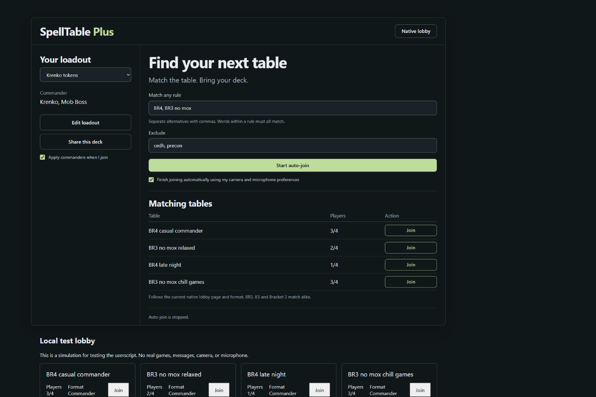

# SpellTable Plus

## Standalone Windows app — local preview

The project now includes its own desktop app and local room server. Run `npm run desktop` or `npm run desktop:four` for four isolated player windows using local footage. See [desktop setup, tested features and limitations](docs/DESKTOP.md).

Verified locally: keyword matchmaking through a separate server process, twelve incoming video/audio streams through coturn relay transport, synchronized state, reconnects, camera stop/start, fifth-seat rejection, and card detections from received video. The packaged app passed a two-minute continuous media check. Hosting is deferred. Recognition runs locally against installed artwork; broader accuracy and library coverage are still being evaluated. See [verification and release boundaries](docs/GOAL_STATUS.md).

## Original userscript

A Tampermonkey userscript for a cleaner SpellTable lobby, saved Commander loadouts, Moxfield sharing, and keyword-based auto-join.

**Early release:** live lobby discovery and filtering have been checked on SpellTable. Room entry and commander selection have been exercised in a local simulation, not an actual multiplayer room. English SpellTable UI is required for the current adapters.



## Install

1. Install [Tampermonkey](https://www.tampermonkey.net/) for your browser.
2. Open **[Install SpellTable Plus](https://raw.githubusercontent.com/kgeg401/spelltable-plus/main/dist/spelltable-plus.user.js)** and accept Tampermonkey's installation prompt.
3. Open or refresh the [SpellTable lobby](https://spelltable.wizards.com/lobby), sign in, and choose **Add loadout**.

If Chrome does not run the script, follow Tampermonkey's [official userscript enablement instructions](https://www.tampermonkey.net/faq.php#Q209). Installing this repository alone does not install the script in your browser.

## Features

- **Refreshed lobby:** dark charcoal and sage interface, an open-table list, readable filters, responsive layout, and a collapsible in-game loadout panel. **Native lobby** collapses the panel so the original site controls remain accessible.
- **Deck loadouts:** save a name, one or two full commander names, a Moxfield deck link, and match preferences. Loadouts stay in this browser's userscript storage. There is no server or analytics.
- **Auto-select commanders:** after joining as a player, the selected loadout uses SpellTable's own commander search. It only selects an exact result and checks that the name appears in your player row. It does not change opponents' commanders or clear existing commanders. If a different commander is set, clear it in the native panel before retrying **Apply commanders**.
- **Share this deck:** fills an empty, recognized chat composer when one is available; otherwise copies a chat-ready Moxfield link. It never sends automatically and never replaces an existing chat draft.
- **Native deck link:** in a game, **Set native deck link** fills SpellTable's existing deck-link dialog. Click its **Submit** button to change your profile's deck link. This is a profile setting, not a chat message.
- **Keyword auto-join:** watches the currently displayed lobby page, skips full tables, waits five seconds, rechecks availability, and clicks the matching table's native Join button. It stops after one attempt. Optional automatic **Join Now** completion uses your existing camera/microphone preferences.

### Chat limitation

The SpellTable application inspected on September 21, 2026 exposes a game log and deck-list sharing, but no native text-chat composer. This userscript does **not** create a shared chat service. Use **Share this deck** to copy the link for Discord or another group chat, or set the native deck link so other players can view it. Composer insertion is tested against a simulated compatible chat UI and is provided for compatible additions/future UI changes.

## Match rules

| Input | Meaning |
| --- | --- |
| `BR4` | A title containing bracket 4 |
| `BR4, BR3 no mox` | Bracket 4 **or** bracket 3 with the phrase “no mox” |
| `BR3 casual` | Both bracket 3 and casual |
| Exclude: `cedh, precon` | Reject either word |

Matching ignores case and punctuation. `BR3`, `B3`, `BR 3`, and `Bracket 3` are equivalent. Commas or newlines separate alternatives; words within one alternative must all match. `no`, `not`, and `without` stay attached to the next word, so `no proxies, mox allowed` does not satisfy `no mox`. Other words match whole tokens: `precon` and `precons` are separate, as are `mox` and `moxfield`. Include both spellings when needed. No regular expressions or fuzzy power-level guesses.

Auto-join only starts when you click **Start auto-join**. **Stop auto-join**, Escape, editing filters, changing loadouts, opening the native lobby, or leaving the lobby cancels the queue. It does not resume on reload. The checkbox below Start controls whether the prejoin screen is completed automatically; uncheck it to review camera and microphone settings first.

**Scope:** this is a client-side lobby assistant, not a new matchmaking backend. It cannot reserve seats or verify whether a title truthfully describes a deck's power level. It follows SpellTable's current native page and format, and the site's refresh timing. It does not scan undisplayed pages, refresh the entire site, or call private APIs. Choose another page using the native lobby controls if needed. Finish your normal Rule 0 conversation with the table.

## Develop

Requires Node.js 22+.

```sh
npm ci
npm run check
npm run dev
```

Open `http://127.0.0.1:4173/lobby` for an isolated simulation. Demo data is explicitly fake, including its Moxfield URL. No actual room is joined and no camera, microphone, or network game services are used. The local server listens only on loopback.

- `src/core.js`: matching, URL validation, loadout validation, one-shot countdown.
- `src/adapter.js`: the current SpellTable DOM contract and framework-compatible input events.
- `src/ui.js` / `src/styles.css`: isolated Shadow DOM interface.
- `src/main.js`: local storage, route handling, queue and loadout orchestration.
- `dist/spelltable-plus.user.js`: installable, self-contained script; no runtime dependencies.
- `test/`: behavioral and DOM integration tests.
- `docs/VALIDATION.md`: evidence and remaining verification limits.

Build after changing source and commit the generated `dist` files. GitHub Actions tests and rebuilds the script, then checks that the committed bundle matches. Do not commit personal loadout exports, cookies, tokens, or copied site bundles.

The site can change its markup at any time. If an adapter cannot recognize a control, it should stop and show a message. File an issue with the action, browser, site language, and a redacted screenshot; do not include account credentials or game participants' private information.

Unofficial community project; not affiliated with Wizards of the Coast, SpellTable, Moxfield, or Tampermonkey.
